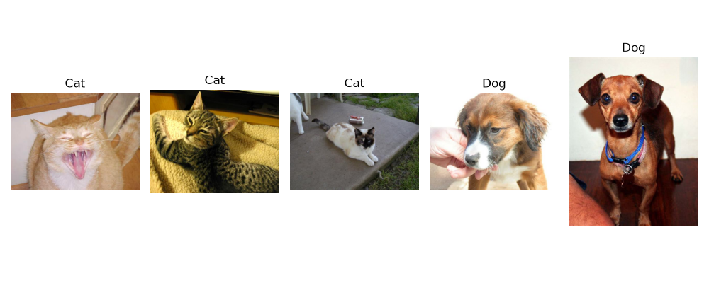
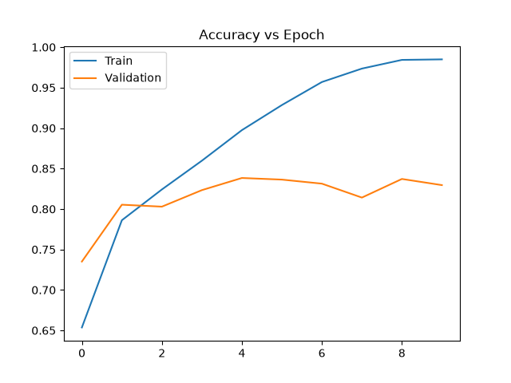
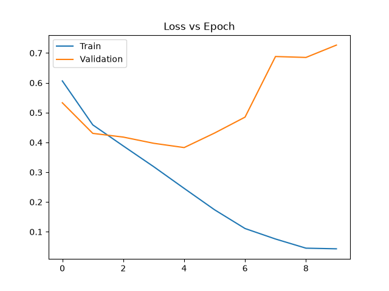

# Image Classification using Convolutional Neural Networks (CNN)

**Author:** Jagriti Srivastava

**Registration Number:** 23MIP10068

**Application Number:** IN26011508

**Batch Number:** 1A

**Email ID:** jagriti.23mip10068@vitbhopal.ac.in

---

# Objective

The objective of this project is to build a Convolutional Neural Network (CNN) to classify images of cats and dogs. The model learns visual features automatically from images and predicts whether an input image belongs to the Cat or Dog class.

---

# Dataset Link

**Microsoft Cats vs Dogs Dataset**

https://www.kaggle.com/datasets/shaunthesheep/microsoft-catsvsdogs-dataset

---

# Libraries Used

- os
- random
- matplotlib
- tensorflow
- keras
- scikit-learn

---

# Methodology

## Data Understanding

- Loaded the Cats vs Dogs dataset from the PetImages folder.
- Displayed the folder structure.
- Counted the total number of images.
- Displayed five sample images from the dataset.

## Data Preprocessing

- Resized all images to **128 × 128** pixels.
- Normalized pixel values using ImageDataGenerator.
- Split the dataset into **80% training** and **20% validation**.

## CNN Model Development

The CNN architecture consists of:

- Conv2D (32 filters) + MaxPooling2D
- Conv2D (64 filters) + MaxPooling2D
- Conv2D (128 filters) + MaxPooling2D
- Flatten Layer
- Dense Layer (128 neurons)
- Output Layer (1 neuron with Sigmoid activation)

The model was compiled using:

- Optimizer: Adam
- Loss Function: Binary Crossentropy
- Evaluation Metric: Accuracy

The model was trained for **10 epochs**.

---

# Results

The trained CNN model achieved the following performance:

- **Test Accuracy:** **82.95%**
- **Precision:** **0.82**
- **Recall:** **0.85**
- **F1-Score:** **0.83**

The model successfully classified images of cats and dogs with good accuracy.

---

# Output

## Sample Images

## Accuracy vs Epoch

## Loss vs Epoch

---

# Observations

1. The CNN successfully learned important image features from cats and dogs.
2. Training and validation accuracy improved over multiple epochs.
3. Loss decreased steadily during training, indicating effective learning.
4. Convolution and pooling layers extracted meaningful visual patterns for classification.

---

# Conclusion

This project successfully implemented a Convolutional Neural Network (CNN) for binary image classification using the Microsoft Cats vs Dogs dataset. The CNN achieved an accuracy of approximately **82.95%** and demonstrated good precision, recall, and F1-score. The model automatically extracted image features without manual feature engineering, making CNN highly effective for image classification tasks. One limitation is that CNN models require more computational resources and longer training time compared to traditional machine learning algorithms.
